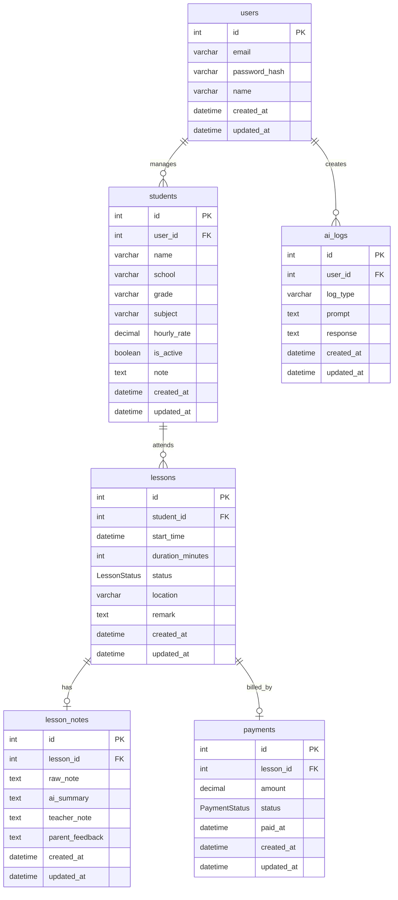

# TutorFlow AI - MVP Requirements

## 🎯 目標

打造一個提供家教老師管理學生、課程及 AI 協助撰寫紀錄的平台。

---

# MVP Scope

## 1. Authentication

- [ ] 使用者註冊
- [ ] 使用者登入
- [ ] JWT Authentication
- [ ] 登出

---

## 2. Student Management

- [ ] 新增學生
- [ ] 查看學生列表
- [ ] 查看學生資訊
- [ ] 編輯學生
- [ ] 刪除學生

---

## 3. Lesson Management

- [ ] 新增課程
- [ ] 修改課程
- [ ] 刪除課程
- [ ] 上課紀錄

---

## 4. Dashboard

- [ ] 今日課程
- [ ] 本月收入
- [ ] 學生數量

---

## 5. AI Features

- [ ] AI 生成上課紀錄
- [ ] AI 生成家長回饋

---

## 6. Payment

- [ ] 每堂課收費
- [ ] 已付款
- [ ] 未付款

---

# MVP 完成條件

當使用者可以：

1. 註冊並登入
2. 建立學生
3. 建立課程
4. AI 生成上課紀錄
5. AI 生成家長回饋
6. 記錄收費狀態
7. Dashboard 顯示基本統計

即可視為 MVP 完成。

---

# 資料庫設計 / ER Diagram

第二階段資料表關聯如下：

- `users`：系統使用者，也就是家教老師帳號
- `students`：學生資料，屬於某一位使用者
- `lessons`：課程紀錄，屬於某一位學生
- `lesson_notes`：課後紀錄與 AI 產生內容，屬於某一堂課
- `payments`：付款紀錄，屬於某一堂課，學生可透過 Lesson 關聯取得
- `ai_logs`：AI 使用紀錄，屬於某一位使用者

